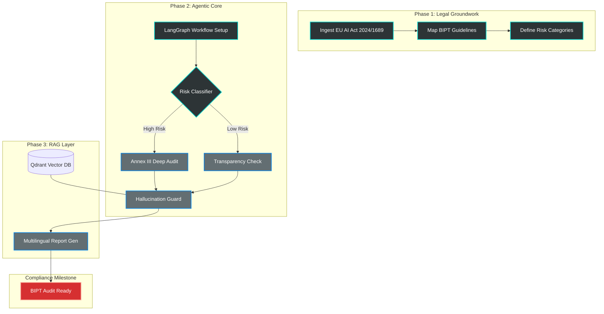

# 🗺️ LexGuardBE Development Roadmap

This roadmap outlines the path to full compliance readiness ahead of the **August 2026** enforcement deadline.

## 📊 High-Level Architecture Flow

---

## 📅 Implementation Phases

### Phase 1: Legal Ingestion & Mapping (Q3 2025)
*   **Goal**: Create a high-fidelity vector representation of the law.
*   [x] Parse EU AI Act (Official Text 2024/1689).
*   [ ] Integrate Belgian BIPT Circulars (AI-SPEC-2025-01).
*   [ ] Multi-lingual embedding generation (NL/FR/EN).

### Phase 2: Agentic Orchestration (Q4 2025)
*   **Goal**: Build the decision engine using [[The Agentic Stack]].
*   [ ] Implement **LangGraph** state machines for multi-step audits.
*   [ ] Develop the "Risk Categorizer" agent (LLM + Semantic Search).
*   [ ] Build "Hallucination Guards" to verify legal citations.

### Phase 3: Reporting & Human-in-the-loop (Q1 2026)
*   **Goal**: Generate regulatory-grade outputs.
*   [ ] Automate **Annex III Conformity Reports**.
*   [ ] Deploy the **HITL Review Dashboard** for Legal Officers.
*   [ ] API stabilization for [[Developer Integration Guide|Developer SDK]].

### Phase 4: Hardening & BIPT Certification (Q2 2026)
*   **Goal**: Final validation before the August deadline.
*   [ ] Stress testing against "Prohibited" AI categories.
*   [ ] Final audit trail immutability checks.
*   [ ] **BIPT Sandboxing**: Collaborative testing with Belgian regulators.

---
[[Lexguard|← Back to Hub]]