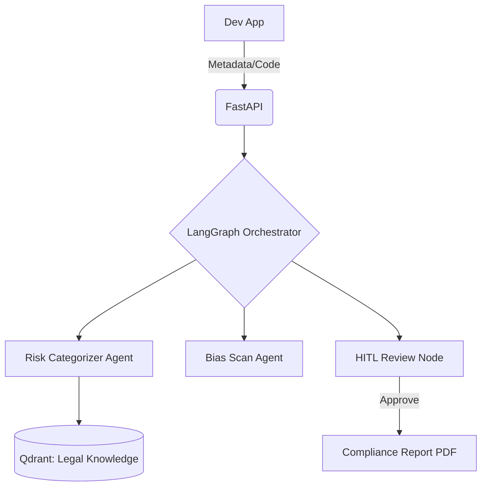

# 🏗️ The Agentic Stack: Technical Architecture

LexGuardBE is built on a modern, asynchronous Python stack designed for stateful compliance auditing.

## 🔄 Orchestration: LangGraph
We use **LangGraph** to manage the complex, cyclical nature of legal reasoning. Unlike simple linear chains, compliance requires:
- **Decision Cycles**: Evaluating a system, identifying gaps, and re-evaluating after a fix.
- **Persistence**: Checkpointing the state of an audit so it can be resumed by a human auditor.
- **Conditional Routing**: Sending a system to a "Bias Scan" agent only if it is classified as High-Risk.

## 🧠 Intelligence: Qdrant & Legal RAG
Our **Retrieval-Augmented Generation (RAG)** system ensures that every compliance recommendation is grounded in law.
- **Vector Store**: **Qdrant** stores embeddings of the EU AI Act, Belgian BIPT circulars, and ISO standards.
- **Hybrid Search**: Combining semantic search with keyword matching for precise Article retrieval (e.g., searching for "Art. 14 Human Oversight").
- **Multi-tenancy**: Isolated collections for different clients/projects to ensure data privacy.

## 🚀 Backend: FastAPI
The engine is exposed via a high-performance **FastAPI** wrapper.
- **Async Processing**: Audit scans run in the background via Celery/Redis.
- **Pydantic Validation**: Strict schema enforcement for system metadata.
- **OpenAPI 3.1**: Auto-generated documentation for developer integration.

## 📊 Data Flow Diagram

---
[[Lexguard|← Back to Hub]]
