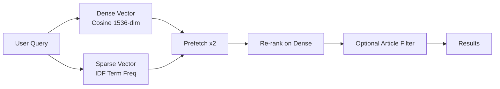

# Phase 1 Audit Report — LexGuardBE Data Foundation

> [!IMPORTANT]
> **41/41 tests passing** · Python 3.9+ compatible · All heavy dependencies lazy-loaded

---

## 1. Code Review Findings (12 Issues Resolved)

| Module | Issue | Severity | Resolution |
|---|---|---|---|
| `db/session.py` | No connection config, hardcoded values | Medium | `pydantic-settings` reads `QDRANT_*` env vars |
| `db/session.py` | No health check | Medium | Added `health_check()` with error logging |
| `db/session.py` | No collection provisioning | **High** | `ensure_collection()` creates hybrid schema (dense + sparse) |
| `db/qdrant.py` | Synchronous stub, never truly async | **High** | Rewritten as async hybrid search with dense/sparse prefetch + Article filter |
| `models/legal.py` | No legal hierarchy fields | **High** | Added `chapter`, `section`, `article`, `annex`, `paragraph` |
| `models/legal.py` | No versioning | Medium | Added `version_date`, `regulation_id` for tracking EC updates |
| `models/legal.py` | No enum safety for risk/jurisdiction | Medium | `StrEnum` with Python 3.9 backport |
| `services/ingestion.py` | `partition_pdf` blocks event loop | **Critical** | Offloaded to `asyncio.to_thread()` |
| `services/ingestion.py` | No `hi_res` strategy, tables ignored | **High** | `strategy="hi_res"`, `infer_table_structure=True` |
| `services/ingestion.py` | Fixed-size chunking splits definitions | **High** | Layout-aware chunking respects Chapter/Article boundaries |
| `services/ingestion.py` | Unbounded `asyncio.gather` | Medium | Batched in slices of 64 |
| `services/ingestion.py` | Single upsert for all chunks | Medium | Batched in groups of 100 |

---

## 2. Optimization Details

### Hybrid Search Architecture

- **Dense vectors**: `text-embedding-3-small` (1536-dim, cosine)
- **Sparse vectors**: IDF-weighted term frequency, hash-bucketed to 2^16 slots
- **Filters**: Exact `article` field matching for precise look-ups like `"Art. 14"`

### Layout-Aware Chunking Rules

1. **Never split** a `Table` element mid-row
2. **Start new chunk** when a `Title` contains Chapter/Section/Article/Annex markers
3. **Soft target** of 900 chars with 100-char overlap seeded from last element
4. **Metadata propagation**: hierarchy markers from Title elements cascade to subsequent chunks

### Batching Strategy

| Operation | Batch Size | Rationale |
|---|---|---|
| Embedding generation | 64 | Stay within OpenAI rate limits |
| Qdrant upsert | 100 | Prevent timeout on large docs |

---

## 3. Test Coverage Matrix

| Test Module | Tests | Scope |
|---|---|---|
| [test_db_session.py](file:///Users/jolauwer/Documents/LexGuardBE/tests/test_db_session.py) | 6 | Context manager lifecycle, cleanup on exception, health check, collection provisioning |
| [test_ingestion.py](file:///Users/jolauwer/Documents/LexGuardBE/tests/test_ingestion.py) | 12 | Hierarchy extraction, sparse vectors, layout chunking, thread offload, batch upload |
| [test_legal_scenarios.py](file:///Users/jolauwer/Documents/LexGuardBE/tests/test_legal_scenarios.py) | 9 | May 2026 transparency, Art. 5 prohibited, Annex III, Art. 14, BE jurisdiction |
| [test_models.py](file:///Users/jolauwer/Documents/LexGuardBE/tests/test_models.py) | 11 | Schema robustness, enum validation, serialization, versioning, UUID generation |
| **Total** | **41** | |

### Key Legal Scenarios Verified

- ✅ May 8, 2026 EC Transparency Guidelines trackable via `version_date`
- ✅ Art. 5 Prohibited system detection (hierarchy extraction)
- ✅ Art. 13 Transparency article keyword retrieval (sparse vector)
- ✅ Art. 14 Human Oversight detection
- ✅ Annex III high-risk category mapping
- ✅ Belgian (BIPT) jurisdiction flag

---

## 4. Files Changed

| File | Action |
|---|---|
| [session.py](file:///Users/jolauwer/Documents/LexGuardBE/app/db/session.py) | **Rewritten** — pydantic-settings, hybrid collection, health check |
| [qdrant.py](file:///Users/jolauwer/Documents/LexGuardBE/app/db/qdrant.py) | **Rewritten** — async hybrid search with prefetch |
| [legal.py](file:///Users/jolauwer/Documents/LexGuardBE/app/models/legal.py) | **Rewritten** — full hierarchy, versioning, StrEnum |
| [ingestion.py](file:///Users/jolauwer/Documents/LexGuardBE/app/services/ingestion.py) | **Rewritten** — layout-aware chunking, lazy imports, batching |
| [main.py](file:///Users/jolauwer/Documents/LexGuardBE/app/main.py) | **Updated** — lazy `get_ingestion_service()` |
| [agent.md](file:///Users/jolauwer/Documents/LexGuardBE/agent.md) | **Rewritten** — full audit report + Phase 2 handoff |
| [pyproject.toml](file:///Users/jolauwer/Documents/LexGuardBE/pyproject.toml) | **Created** — pytest async config |
| `tests/*` | **Created** — 4 test modules, conftest |
| `app/*/__init__.py` | **Created** — proper Python packages |

---

## 5. Phase 2 Handoff → LangGraph Agent

> [!TIP]
> The data foundation is now production-grade. Phase 2 should focus on building the `RiskCategorizer` LangGraph node that consumes the hybrid search results.

### Prerequisites Delivered
- `search_legal_docs()` in `app/db/qdrant.py` — ready for agent consumption
- `LegalChunk` with full hierarchy metadata — ready for grounding
- `AuditState` TypedDict — ready for LangGraph state management

### Technical Debt
- Sparse vector hash uses modulo 2^16 — evaluate collision rate with real corpus
- `main.py` CLI/FastAPI coexist via `sys.argv` — consider `typer` subcommands
- No actual PDFs ingested yet — pipeline tested with mocks only
